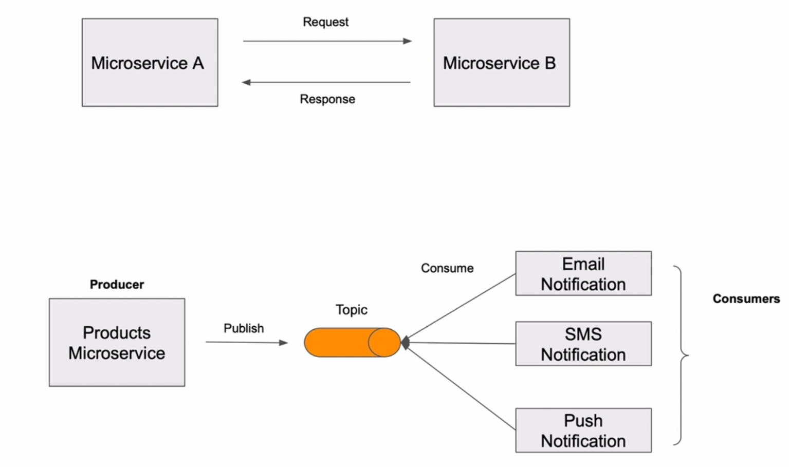

# 1. Introduction to Apache Kafka

## 2. What is Microservice

## 3. Microservice vs Monolithic application

## 4. Microservices Communication

## 5. Event-Driven Architecture with Apache Kafka

## 6. Apache Kafka for Microservices

## 7. Apache Kafka for Microservices Quiz

## 8. Messages and Events in Apache Kafka

## 9. Kafka Topic and Partitions

## 10. Ordering of Events in Apache Kafka

## 11. Quiz Kafka Topics, Partitions and Messages
