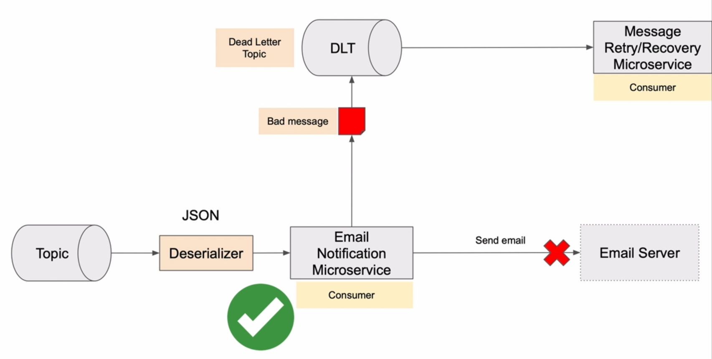
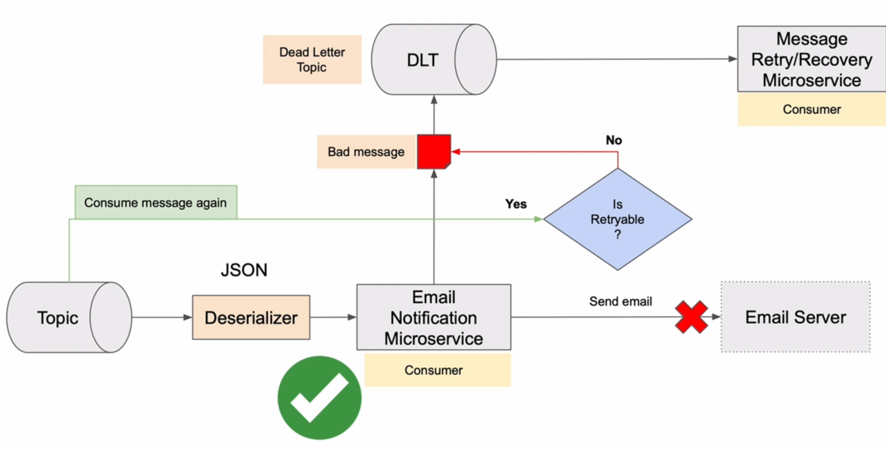
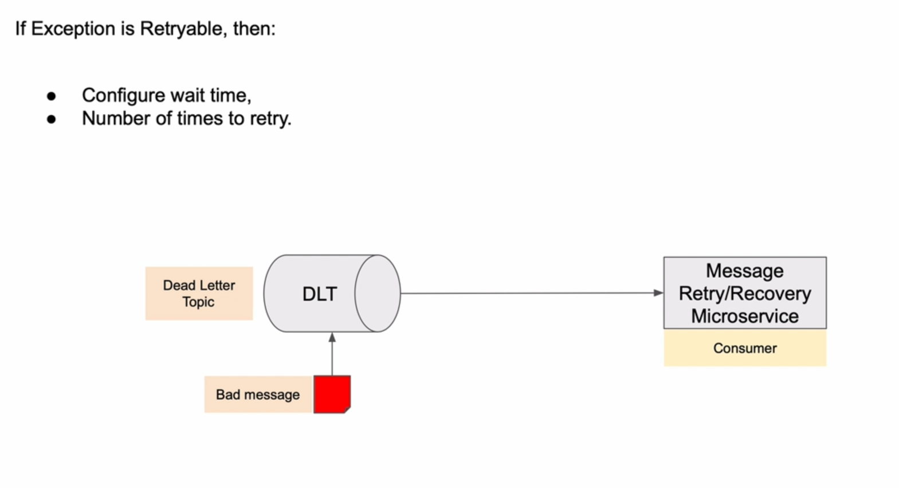

# 11. Kafka Consumer - Exceptions and Retries

## 2. Introduction to Exception handling in Kafka consumer and retries





## 3. Creating retryable and not retryable exceptions


```java
package com.wchamarakafka.ws.emailnotification.error;

public class NotRetryableException extends RuntimeException {

    public NotRetryableException(String message) {
        super(message);
    }

    public NotRetryableException(Throwable cause) {
        super(cause);
    }
}

```

```java
package com.wchamarakafka.ws.emailnotification.error;

public class RetryableException extends RuntimeException {
    public RetryableException(String message) {
        super(message);
    }

    public RetryableException(Throwable cause) {
        super(cause);
    }
}

```

## 4. Configure DefaultErrorHandler with a list of not retryable exceptions

```java
package com.wchamarakafka.ws.emailnotification;

import com.wchamarakafka.ws.emailnotification.error.NotRetryableException;
import org.apache.kafka.clients.consumer.ConsumerConfig;
import org.apache.kafka.clients.producer.ProducerConfig;
import org.apache.kafka.common.serialization.StringDeserializer;
import org.apache.kafka.common.serialization.StringSerializer;
import org.springframework.context.annotation.Bean;
import org.springframework.context.annotation.Configuration;
import org.springframework.core.env.Environment;
import org.springframework.kafka.config.ConcurrentKafkaListenerContainerFactory;
import org.springframework.kafka.core.*;
import org.springframework.kafka.listener.DeadLetterPublishingRecoverer;
import org.springframework.kafka.listener.DefaultErrorHandler;
import org.springframework.kafka.support.serializer.ErrorHandlingDeserializer;
import org.springframework.kafka.support.serializer.JsonDeserializer;
import org.springframework.kafka.support.serializer.JsonSerializer;

import java.util.HashMap;
import java.util.Map;

@Configuration
public class KafkaConsumerConfiguration {

    Environment environment;

    public KafkaConsumerConfiguration(Environment environment) {
        this.environment = environment;
    }

    @Bean
    public ConsumerFactory<String, Object> consumerFactory() {
        Map<String, Object> config = new HashMap<>();
        config.put(ConsumerConfig.BOOTSTRAP_SERVERS_CONFIG, environment.getProperty("spring.kafka.consumer.bootstrap-servers"));
        config.put(ConsumerConfig.GROUP_ID_CONFIG, environment.getProperty("spring.kafka.consumer.group-id"));
        config.put(ConsumerConfig.KEY_DESERIALIZER_CLASS_CONFIG, StringDeserializer.class);
        config.put(ConsumerConfig.VALUE_DESERIALIZER_CLASS_CONFIG, ErrorHandlingDeserializer.class);
        config.put(ErrorHandlingDeserializer.VALUE_DESERIALIZER_CLASS, JsonDeserializer.class);
        config.put(JsonDeserializer.TRUSTED_PACKAGES, environment.getProperty("spring.kafka.consumer.properties.spring.json.trusted.packages"));
        return new DefaultKafkaConsumerFactory<>(config);
    }

    @Bean
    ConcurrentKafkaListenerContainerFactory<String, Object> kafkaListenerContainerFactory(ConsumerFactory<String, Object> consumerFactory, KafkaTemplate<String, Object> kafkaTemplate) {

        /**
         * Configures a default error handler for the Kafka consumer.
         * The error handler uses a DeadLetterPublishingRecoverer with a KafkaTemplate
         * to publish failed messages to a dead-letter topic.
         * 
         * It also adds NotRetryableException class as a not retryable exception,
         * meaning that if a message processing fails due to this exception,
         * it will not be retried by the consumer.
         * 
         * @param kafkaTemplate The KafkaTemplate used for publishing failed messages.
         */
        DefaultErrorHandler defaultErrorHandler = new DefaultErrorHandler(new DeadLetterPublishingRecoverer(kafkaTemplate));
        defaultErrorHandler.addNotRetryableExceptions(NotRetryableException.class);
        
        
        ConcurrentKafkaListenerContainerFactory<String, Object> factory = new ConcurrentKafkaListenerContainerFactory<>();
        factory.setConsumerFactory(consumerFactory);
        factory.setCommonErrorHandler(defaultErrorHandler);
        return factory;
    }

    @Bean
    KafkaTemplate<String, Object> kafkaTemplate(ProducerFactory<String, Object> producerFactory) {
        return new KafkaTemplate<>(producerFactory);
    }

    @Bean
    ProducerFactory<String, Object> producerFactory() {
        Map<String, Object> config = new HashMap<>();
        config.put(ProducerConfig.BOOTSTRAP_SERVERS_CONFIG, environment.getProperty("spring.kafka.consumer.bootstrap-servers"));
        config.put(ProducerConfig.VALUE_SERIALIZER_CLASS_CONFIG, JsonSerializer.class);
        config.put(ProducerConfig.KEY_SERIALIZER_CLASS_CONFIG, StringSerializer.class);

        return new DefaultKafkaProducerFactory<>(config);
    }

}
```

## 5. Trying how not retryable exception works

## 6. Register RetryableException and define wait time interval

## 7. Throwing a RetryableException

## 8. Overview of a destination Microservice

## 9. Trying how retry works
