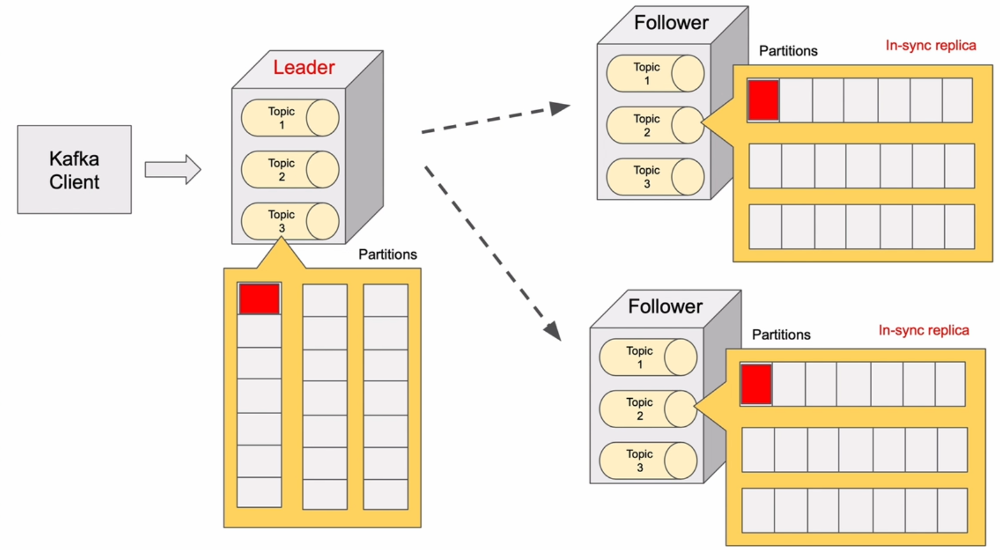

# 2. Apache Kafka Broker(s)

## 1. What is Apache Kafka broker


## 2. Apache Kafka broker Leader and Follower roles. Leadership balance





## 4. Download Apache Kafka

go to <https://kafka.apache.org/>


download the latest version of Apache Kafka
and unzip it to a folder

```bash
tar -xzf kafka_2.13-2.8.0.tgz
cd kafka_2.13-2.8.0
```

and rename the folder to `kafka`

```bash
mv kafka_2.13-2.8.0 kafka
```


## 5. Start single Apache Kafka broker with KRaft

```powershell
<# 
 * Generates a random UUID using the `kafka-storage.bat` script located in the `bin\windows` directory.
 * This command can be used to generate a unique identifier for various purposes in Apache Kafka.
#>
.\bin\windows\kafka-storage.bat random-uuid
```

```powershell
y0h6aogqR2uN1pjLMJj_2g
```

let's add the above id to

```powershell
<# 
 * Formats the Kafka storage using the specified topic and server properties.
 * 
 * @param topic - The topic to use for formatting the storage.
 * @param serverProperties - The path to the server properties file.
#>
.\bin\windows\kafka-storage.bat format -t y0h6aogqR2uN1pjLMJj_2g -c .\config\kraft\server.properties
metaPropertiesEnsemble=MetaPropertiesEnsemble(metadataLogDir=Optional.empty, dirs={/tmp/kraft-combined-logs: EMPTY})
Formatting /tmp/kraft-combined-logs with metadata.version 3.7-IV4.
```

let's run the kafka server

```powershell
<# 
 * Starts the Apache Kafka broker using the provided server properties file.
 * 
 * @param serverPropertiesFile The path to the server properties file.
#>
.\bin\windows\kafka-server-start.bat .\config\kraft\server.properties
```

to stop the server

```powershell
<# 
 * Stops the Apache Kafka broker using the provided server properties file.
 * 
 * @param serverPropertiesFile The path to the server properties file.
#>
.\bin\windows\kafka-server-stop.bat .\config\kraft\server.properties
```

or


## 6. Multiple Kafka broker Configuration Files

copy the `server.properties` file to `server-1.properties`,`server-2.properties` and `server-3.properties`

and update the following properties

```properties

# The node id associated with this instance's roles
node.id=1

# The connect string for the controller quorum
controller.quorum.voters=1@localhost:9093,2@localhost:9095,3@localhost:9097

# The address the socket server listens on.
# Combined nodes (i.e. those with `process.roles=broker,controller`) must list the controller listener here at a minimum.
# If the broker listener is not defined, the default listener will use a host name that is equal to the value of java.net.InetAddress.getCanonicalHostName(),
# with PLAINTEXT listener name, and port 9092.
#   FORMAT:
#     listeners = listener_name://host_name:port
#   EXAMPLE:
#     listeners = PLAINTEXT://your.host.name:9092
listeners=PLAINTEXT://:9092,CONTROLLER://:9093


# Listener name, hostname and port the broker will advertise to clients.
# If not set, it uses the value for "listeners".
advertised.listeners=PLAINTEXT://localhost:9092


############################# Log Basics #############################

# A comma separated list of directories under which to store log files
log.dirs=/tmp/server-1/kraft-combined-logs

```

```properties

# The node id associated with this instance's roles
node.id=2

# The connect string for the controller quorum
controller.quorum.voters=1@localhost:9093,2@localhost:9095,3@localhost:9097

# The address the socket server listens on.
# Combined nodes (i.e. those with `process.roles=broker,controller`) must list the controller listener here at a minimum.
# If the broker listener is not defined, the default listener will use a host name that is equal to the value of java.net.InetAddress.getCanonicalHostName(),
# with PLAINTEXT listener name, and port 9092.
#   FORMAT:
#     listeners = listener_name://host_name:port
#   EXAMPLE:
#     listeners = PLAINTEXT://your.host.name:9092
listeners=PLAINTEXT://:9094,CONTROLLER://:9095

# Listener name, hostname and port the broker will advertise to clients.
# If not set, it uses the value for "listeners".
advertised.listeners=PLAINTEXT://localhost:9094


############################# Log Basics #############################

# A comma separated list of directories under which to store log files
log.dirs=/tmp/server-2/kraft-combined-logs
```

```properties

# The node id associated with this instance's roles
node.id=3

# The connect string for the controller quorum
controller.quorum.voters=1@localhost:9093,2@localhost:9095,3@localhost:9097

# The address the socket server listens on.
# Combined nodes (i.e. those with `process.roles=broker,controller`) must list the controller listener here at a minimum.
# If the broker listener is not defined, the default listener will use a host name that is equal to the value of java.net.InetAddress.getCanonicalHostName(),
# with PLAINTEXT listener name, and port 9092.
#   FORMAT:
#     listeners = listener_name://host_name:port
#   EXAMPLE:
#     listeners = PLAINTEXT://your.host.name:9092
listeners=PLAINTEXT://:9096,CONTROLLER://:9097

# Listener name, hostname and port the broker will advertise to clients.
# If not set, it uses the value for "listeners".
advertised.listeners=PLAINTEXT://localhost:9096


############################# Log Basics #############################

# A comma separated list of directories under which to store log files
log.dirs=/tmp/server-3/kraft-combined-logs
```

## 7. Multiple Kafka broker Storage folders

let's generate the random UUIDs for the storage folders

`format`: This is a command that is passed to the kafka-storage.bat script. The format command is used to initialize or reformat the storage layer of a Kafka server.

`-t 8Q1WsNNpRdS9Uzhr8DkN6Q`: The `-t` option is used to specify a cluster id for the Kafka server. `8Q1WsNNpRdS9Uzhr8DkN6Q` is the cluster id in this case.

`-c .\config\kraft\server-1.properties`: The `-c` option is used to specify the configuration file for the Kafka server. .`\config\kraft\server-1.properties` is the path to the configuration file, relative to the current directory.

```powershell
.\bin\windows\kafka-storage.bat random-uuid
```

```powershell
.\bin\windows\kafka-storage.bat format -t 8Q1WsNNpRdS9Uzhr8DkN6Q -c .\config\kraft\server-1.properties
```

```powershell
.\bin\windows\kafka-storage.bat format -t 8Q1WsNNpRdS9Uzhr8DkN6Q -c .\config\kraft\server-2.properties
```

```powershell
.\bin\windows\kafka-storage.bat format -t 8Q1WsNNpRdS9Uzhr8DkN6Q -c .\config\kraft\server-3.properties
```

## 8. Starting multiple Kafka broker with KRaft

```powershell
.\bin\windows\kafka-server-start.bat .\config\kraft\server-1.properties
```

```powershell
.\bin\windows\kafka-server-start.bat .\config\kraft\server-2.properties
```

```powershell
.\bin\windows\kafka-server-start.bat .\config\kraft\server-3.properties
```

## 9. Stopping Apache Kafka brokers

```powershell
.\bin\windows\kafka-server-stop.bat
```
