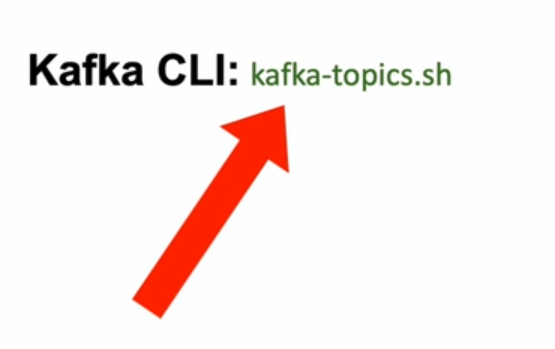
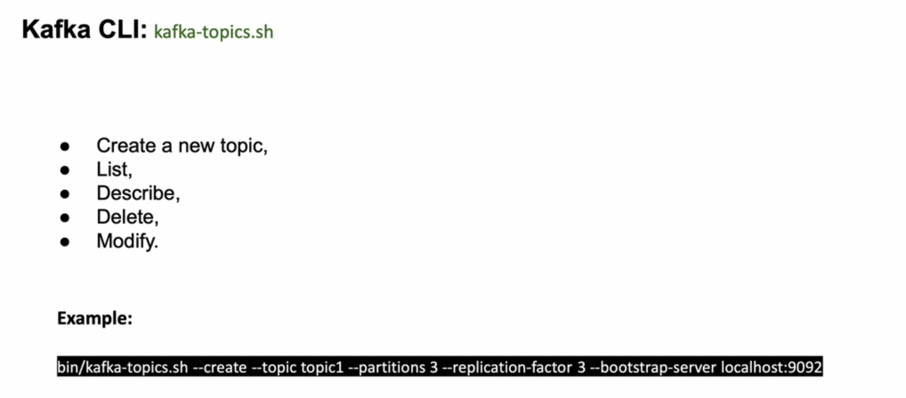
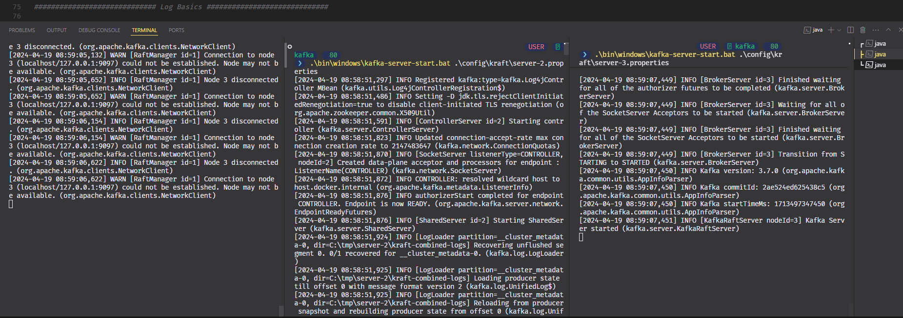
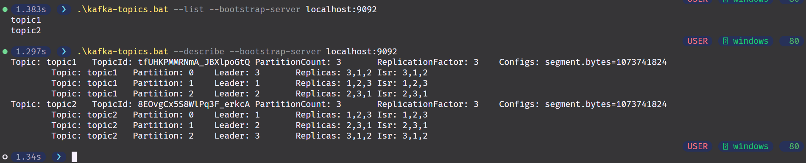
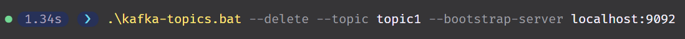

# 3. Kafka CLI Topics

## 1. Introduction to Kafka Topic CLI




## 2. Creating a new Kafka topic

let's start the servers

```powershell
.\bin\windows\kafka-server-start.bat .\config\kraft\server-1.properties
```

```powershell
.\bin\windows\kafka-server-start.bat .\config\kraft\server-2.properties
```

```powershell
.\bin\windows\kafka-server-start.bat .\config\kraft\server-3.properties
```



```powershell

.\kafka-topics.bat --create --topic topic1 --partitions 3 --replication-factor 3 --bootstrap-server localhost:9092,localhost:9094
Created topic topic1.
```

```powershell
.\kafka-topics.bat --create --topic topic2 --partitions 3 --replication-factor 3 --bootstrap-server localhost:9092,localhost:9094
Created topic topic2.
```

## 3. List and describe Kafka topics

```powershell
.\kafka-topics.bat --list --bootstrap-server localhost:9092
```

```powershell
.\kafka-topics.bat --describe --bootstrap-server localhost:9092
```



## 4. Deleting a Topic

```powershell
.\kafka-topics.bat --delete --topic topic1 --bootstrap-server localhost:9092
```


