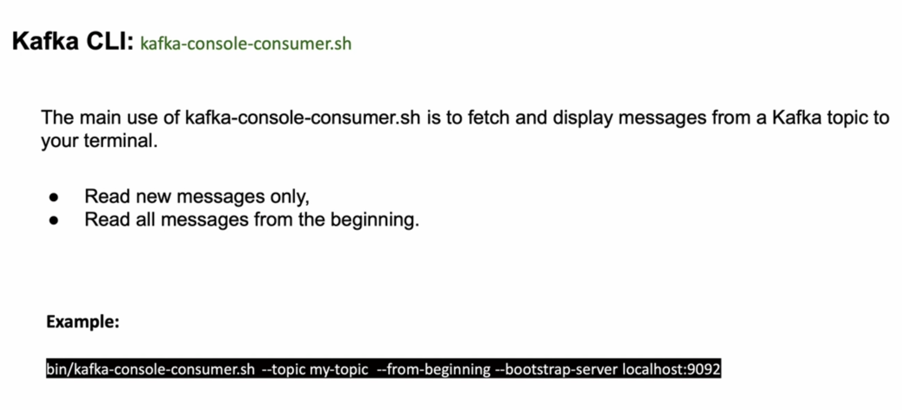
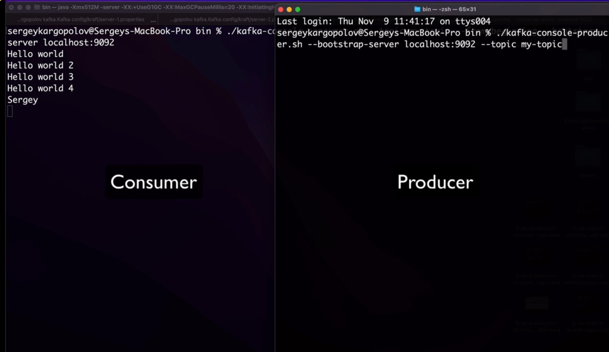
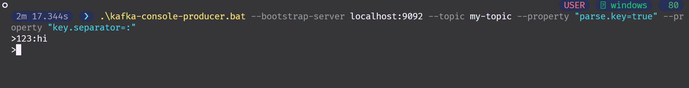
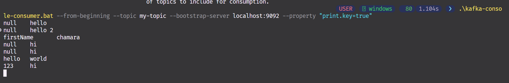
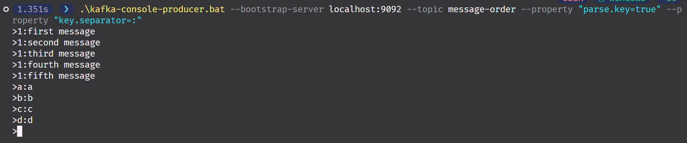
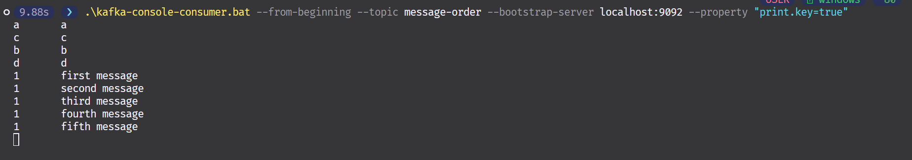

# 5. Kafka CLI Consumers

## 1. Introduction to Kafka Consumer CLI



## 2. Consuming messages from Kafka topic from the beginning

```powershell
.\kafka-console-consumer.bat --topic my-topic --from-beginning --bootstrap-server localhost:9092
hello
hello 2
chamara
```



## 3. Consuming new messages only

if we remove `--from-beginning` flag, we can consume only new messages

```powershell
.\kafka-console-consumer.bat --topic my-topic --bootstrap-server localhost:9092
```

## 4. Consuming KeyValue pair messages from Kafka topic




## 5. Consuming messages in order

```powershell
.\kafka-topics.bat --create --topic message-order --partitions 3 --replication-factor 3 --bootstrap-server localhost:9092    
Created topic message-order.
```

```powershell
.\kafka-console-producer.bat --bootstrap-server localhost:9092 --topic message-order --property "parse.key=true" --property "key.separator=:"
```



