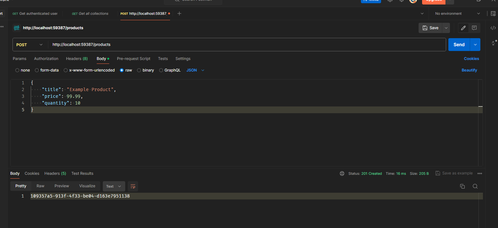
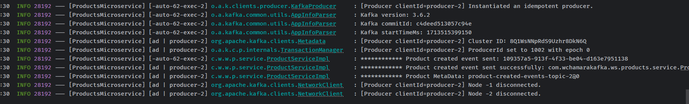
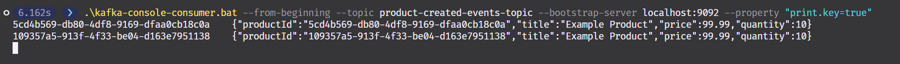
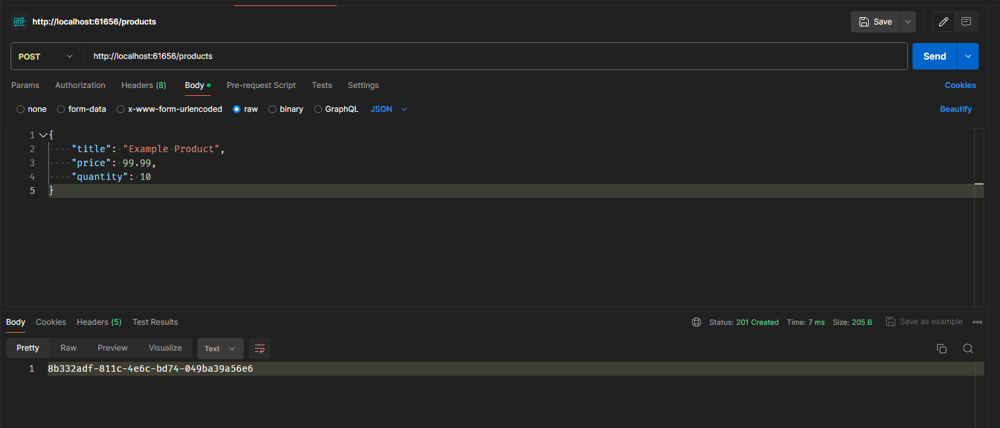
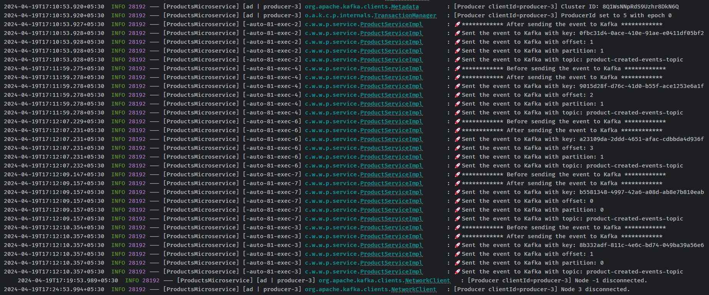
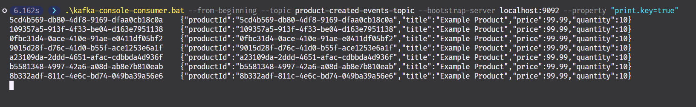

# 6. Kafka Producer - Spring Boot Microservice

## 2. Introduction to Kafka Producer


## 3. Kafka Producer - Introduction to synchronous communication style


## 4. Kafka Producer - A use case for asynchronous communication style


## 6. Creating a new Spring Boot project

<https://start.spring.io/>


and open the project in IntelliJ IDEA

## 7. Kafka Producer configuration properties

```yml
spring:
  application:
    name: ProductsMicroservice
  kafka:
    producer:
      bootstrap-servers: localhost:9092,localhost:9094
      key-serializer: org.apache.kafka.common.serialization.StringSerializer
      value-serializer: org.springframework.kafka.support.serializer.JsonSerializer

server:
  port: 0

```

## 8. Creating Kafka Topic

`ProductsMicroservice/src/main/java/com`

```java
package com.wchamarakafka.ws.products;

import org.apache.kafka.clients.admin.NewTopic;
import org.springframework.context.annotation.Bean;
import org.springframework.context.annotation.Configuration;
import org.springframework.kafka.config.TopicBuilder;

import java.util.Map;

@Configuration
public class KafkaConfig {
    @Bean
    NewTopic createNewTopic() {
        return TopicBuilder.name("product-created-event")
                .partitions(3)
                .replicas(3)
                .configs(Map.of("min.insync.replicas", "2"))
                .build();
    }
}
```

## 9. Run Microservice to create a new topic

```powershell
1.301s ❯ .\kafka-topics.bat --describe --bootstrap-server localhost:9092 --topic product-created-events-topic
Topic: product-created-events-topic     TopicId: PFV-f7ZBRiuO_0sg36KfuQ PartitionCount: 3       ReplicationFactor: 3    Configs: min.insync.replicas=2,segment.bytes=1073741824
        Topic: product-created-events-topic     Partition: 0    Leader: 2       Replicas: 2,3,1 Isr: 2,3,1
        Topic: product-created-events-topic     Partition: 1    Leader: 3       Replicas: 3,1,2 Isr: 3,1,2
        Topic: product-created-events-topic     Partition: 2    Leader: 1       Replicas: 1,2,3 Isr: 1,2,3
```

## 10. Creating Rest Controller

`ProductsMicroservice/src/main/java/com/wchamarakafka/ws/products/rest`

```java
package com.wchamarakafka.ws.products.rest;

import org.springframework.http.HttpStatus;
import org.springframework.http.ResponseEntity;
import org.springframework.stereotype.Controller;
import org.springframework.web.bind.annotation.PostMapping;
import org.springframework.web.bind.annotation.RequestBody;
import org.springframework.web.bind.annotation.RequestMapping;
import org.springframework.web.bind.annotation.RestController;

@RestController
@RequestMapping("/products")
public class ProductController {


    @PostMapping
    public ResponseEntity<String> createProduct(@RequestBody  CreateProductResModel createProductResModel) {
        return ResponseEntity.status(HttpStatus.CREATED).body("");
    }
}

```

```java
package com.wchamarakafka.ws.products.rest;

import java.math.BigDecimal;

public class CreateProductResModel {

    private String title;
    private BigDecimal price;
    private Integer quantity;

    public String getTitle() {
        return title;
    }

    public void setTitle(String title) {
        this.title = title;
    }

    public BigDecimal getPrice() {
        return price;
    }

    public void setPrice(BigDecimal price) {
        this.price = price;
    }

    public Integer getQuantity() {
        return quantity;
    }

    public void setQuantity(Integer quantity) {
        this.quantity = quantity;
    }
}
```

## 11. Creating a Service class

```java
package com.wchamarakafka.ws.products.service;

import com.wchamarakafka.ws.products.rest.CreateProductResModel;

public interface ProductService {
    String createProduct(CreateProductResModel createProductResModel);
}

```

```java
package com.wchamarakafka.ws.products.service;

import com.wchamarakafka.ws.products.rest.CreateProductResModel;
import org.springframework.stereotype.Service;

@Service
public class ProductServiceImpl implements ProductService {
    @Override
    public String createProduct(CreateProductResModel createProductResModel) {
        return "";
    }
}

```

```java
package com.wchamarakafka.ws.products.rest;

import com.wchamarakafka.ws.products.service.ProductService;
import org.springframework.http.HttpStatus;
import org.springframework.http.ResponseEntity;
import org.springframework.web.bind.annotation.PostMapping;
import org.springframework.web.bind.annotation.RequestBody;
import org.springframework.web.bind.annotation.RequestMapping;
import org.springframework.web.bind.annotation.RestController;

@RestController
@RequestMapping("/products")
public class ProductController {

    private final ProductService productService;

    public ProductController(ProductService productService) {
        this.productService = productService;
    }

    @PostMapping
    public ResponseEntity<String> createProduct(@RequestBody CreateProductResModel createProductResModel) {
        String productId = productService.createProduct(createProductResModel);
        return ResponseEntity.status(HttpStatus.CREATED).body(productId);
    }
}

```

## 12. Creating an Event class

```java
package com.wchamarakafka.ws.products.service;

import java.math.BigDecimal;

public class ProductCreatedEvent {
    private String productId;
    private String title;
    private BigDecimal price;
    private Integer quantity;

    public ProductCreatedEvent() {
    }

    public ProductCreatedEvent(String productId, String title, BigDecimal price, Integer quantity) {
        this.productId = productId;
        this.title = title;
        this.price = price;
        this.quantity = quantity;
    }

    public String getProductId() {
        return productId;
    }

    public void setProductId(String productId) {
        this.productId = productId;
    }

    public String getTitle() {
        return title;
    }

    public void setTitle(String title) {
        this.title = title;
    }

    public BigDecimal getPrice() {
        return price;
    }

    public void setPrice(BigDecimal price) {
        this.price = price;
    }

    public Integer getQuantity() {
        return quantity;
    }

    public void setQuantity(Integer quantity) {
        this.quantity = quantity;
    }
}

```

## 13. Kafka Producer Send Message Asynchronously

```java
package com.wchamarakafka.ws.products.service;

import com.wchamarakafka.ws.products.rest.CreateProductResModel;
import org.slf4j.Logger;
import org.slf4j.LoggerFactory;
import org.springframework.kafka.core.KafkaTemplate;
import org.springframework.kafka.support.SendResult;
import org.springframework.stereotype.Service;

import java.util.UUID;
import java.util.concurrent.CompletableFuture;

/**
 * This class is a service that handles product-related operations.
 * It implements the ProductService interface.
 */
@Service
public class ProductServiceImpl implements ProductService {
    // Logger for logging information and errors
    private final Logger logger = LoggerFactory.getLogger(ProductServiceImpl.class);
    // KafkaTemplate for sending messages to Kafka topics
    KafkaTemplate<String, ProductCreatedEvent> kafkaTemplate;

    /**
     * Constructor for the ProductServiceImpl class.
     * @param kafkaTemplate KafkaTemplate for sending messages to Kafka topics
     */
    public ProductServiceImpl(KafkaTemplate<String, ProductCreatedEvent> kafkaTemplate) {
        this.kafkaTemplate = kafkaTemplate;
    }

    /**
     * This method creates a product and sends a product created event to a Kafka topic.
     * @param createProductResModel The model containing the product details
     * @return The ID of the created product
     */
    @Override
    public String createProduct(CreateProductResModel createProductResModel) {

        // Generate a unique ID for the product
        String productId = UUID.randomUUID().toString();
        // TODO: Implement the logic to save the product in the database

        // Create a new product created event
        ProductCreatedEvent productCreatedEvent = new ProductCreatedEvent(productId,
                createProductResModel.getTitle(), createProductResModel.getPrice(),
                createProductResModel.getQuantity());

        // Send the product created event to the Kafka topic
        CompletableFuture<SendResult<String, ProductCreatedEvent>> future = kafkaTemplate.send("product-created-events-topic", productId, productCreatedEvent);

        // Handle the result of the send operation
        future.whenComplete((sendResult, throwable) -> {
            if (throwable == null) {
                // Log the successful send operation
                logger.info("Product created event sent successfully: {}", sendResult.getProducerRecord().value());
                logger.info("Product MetaData: {}", sendResult.getRecordMetadata());
            } else {
                // Log the error in the send operation
                System.out.println("Error sending product created event: " + throwable.getMessage());
            }
        });
        future.join();
        return productId;
    }
}
```

## 14. Kafka Asynchronous Send. Trying how it works





## 15. Kafka Producer Send Message Synchronously

```java
package com.wchamarakafka.ws.products.service;

import com.wchamarakafka.ws.products.rest.CreateProductResModel;
import org.slf4j.Logger;
import org.slf4j.LoggerFactory;
import org.springframework.kafka.core.KafkaTemplate;
import org.springframework.kafka.support.SendResult;
import org.springframework.stereotype.Service;

import java.util.UUID;
import java.util.concurrent.ExecutionException;

@Service
public class ProductServiceImpl implements ProductService {
    private final Logger logger = LoggerFactory.getLogger(ProductServiceImpl.class);
    KafkaTemplate<String, ProductCreatedEvent> kafkaTemplate;

    public ProductServiceImpl(KafkaTemplate<String, ProductCreatedEvent> kafkaTemplate) {
        this.kafkaTemplate = kafkaTemplate;
    }

    @Override
    public String createProduct(CreateProductResModel createProductResModel) throws ExecutionException, InterruptedException {

        String productId = UUID.randomUUID().toString();
//        TODO: Implement the logic to save the product in the database

        ProductCreatedEvent productCreatedEvent = new ProductCreatedEvent(productId,
                createProductResModel.getTitle(), createProductResModel.getPrice(),
                createProductResModel.getQuantity());

        SendResult<String, ProductCreatedEvent> result = kafkaTemplate.send("product-created-events-topic", productId, productCreatedEvent).get();

        logger.info("************ Product created event sent: {}", productId);
        return productId;
    }
}
```

## 16. Kafka Producer Handle Exception in Rest Controller

```java
package com.wchamarakafka.ws.products.service;

import com.wchamarakafka.ws.products.rest.CreateProductResModel;

import java.util.concurrent.ExecutionException;

public interface ProductService {
    String createProduct(CreateProductResModel createProductResModel) throws ExecutionException, InterruptedException;
}

```

```java
package com.wchamarakafka.ws.products.rest;

import java.util.Date;

public class ErrorMessage {
    private Date timestamp;
    private String message;
    private String details;

    public ErrorMessage() {
    }

    public ErrorMessage(Date timestamp, String message, String details) {
        this.timestamp = timestamp;
        this.message = message;
        this.details = details;
    }

    public Date getTimestamp() {
        return timestamp;
    }

    public void setTimestamp(Date timestamp) {
        this.timestamp = timestamp;
    }

    public String getMessage() {
        return message;
    }

    public void setMessage(String message) {
        this.message = message;
    }

    public String getDetails() {
        return details;
    }

    public void setDetails(String details) {
        this.details = details;
    }
}

```

```java
package com.wchamarakafka.ws.products.rest;

import com.wchamarakafka.ws.products.service.ProductService;
import org.slf4j.Logger;
import org.springframework.http.HttpStatus;
import org.springframework.http.ResponseEntity;
import org.springframework.web.bind.annotation.PostMapping;
import org.springframework.web.bind.annotation.RequestBody;
import org.springframework.web.bind.annotation.RequestMapping;
import org.springframework.web.bind.annotation.RestController;

import java.util.Date;
import java.util.concurrent.ExecutionException;

@RestController
@RequestMapping("/products")
public class ProductController {
    private final Logger logger = org.slf4j.LoggerFactory.getLogger(ProductController.class);
    private final ProductService productService;

    public ProductController(ProductService productService) {
        this.productService = productService;
    }

    @PostMapping
    public ResponseEntity<Object> createProduct(@RequestBody CreateProductResModel createProductResModel) {
        String productId = null;
        try {
            productId = productService.createProduct(createProductResModel);
        } catch (ExecutionException | InterruptedException e) {
            logger.error("An error occurred while creating the product", e);
            return ResponseEntity.status(HttpStatus.INTERNAL_SERVER_ERROR).body(new ErrorMessage(new Date(), e.getMessage(), "/products"));
        }
        return ResponseEntity.status(HttpStatus.CREATED).body(productId);
    }
}

```

## 17. Kafka Producer Logging Record Metadata Information

```java
package com.wchamarakafka.ws.products.service;

import com.wchamarakafka.ws.products.rest.CreateProductResModel;
import org.slf4j.Logger;
import org.slf4j.LoggerFactory;
import org.springframework.kafka.core.KafkaTemplate;
import org.springframework.kafka.support.SendResult;
import org.springframework.stereotype.Service;

import java.util.UUID;
import java.util.concurrent.ExecutionException;

@Service
public class ProductServiceImpl implements ProductService {
    private final Logger logger = LoggerFactory.getLogger(ProductServiceImpl.class);
    KafkaTemplate<String, ProductCreatedEvent> kafkaTemplate;

    public ProductServiceImpl(KafkaTemplate<String, ProductCreatedEvent> kafkaTemplate) {
        this.kafkaTemplate = kafkaTemplate;
    }

    @Override
    public String createProduct(CreateProductResModel createProductResModel) throws ExecutionException, InterruptedException {

        String productId = UUID.randomUUID().toString();
//        TODO: Implement the logic to save the product in the database

        ProductCreatedEvent productCreatedEvent = new ProductCreatedEvent(productId,
                createProductResModel.getTitle(), createProductResModel.getPrice(),
                createProductResModel.getQuantity());

        logger.info("🚀************ Before sending the event to Kafka ************");
        SendResult<String, ProductCreatedEvent> result = kafkaTemplate.send("product-created-events-topic", productId, productCreatedEvent).get();
        logger.info("🚀************ After sending the event to Kafka ************");
        logger.info("🚀Sent the event to Kafka with key: {}", result.getProducerRecord().key());
        logger.info("🚀Sent the event to Kafka with offset: {}", result.getRecordMetadata().offset());
        logger.info("🚀Sent the event to Kafka with partition: {}", result.getRecordMetadata().partition());
        logger.info("🚀Sent the event to Kafka with topic: {}", result.getRecordMetadata().topic());


        return productId;
    }
}

```

## 18. Kafka Synchronous Send. Trying how it works




