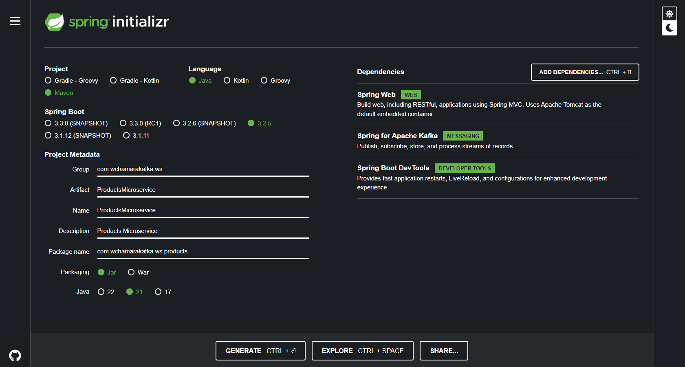

# 6. Kafka Producer - Spring Boot Microservice

## 2. Introduction to Kafka Producer


## 3. Kafka Producer - Introduction to synchronous communication style


## 4. Kafka Producer - A use case for asynchronous communication style


## 6. Creating a new Spring Boot project

<https://start.spring.io/>



and open the project in IntelliJ IDEA

## 7. Kafka Producer configuration properties

```yml
spring:
  application:
    name: ProductsMicroservice
  kafka:
    producer:
      bootstrap-servers: localhost:9092,localhost:9094
      key-serializer: org.apache.kafka.common.serialization.StringSerializer
      value-serializer: org.springframework.kafka.support.serializer.JsonSerializer

server:
  port: 0

```

## 8. Creating Kafka Topic

`ProductsMicroservice/src/main/java/com`

```java
package com.wchamarakafka.ws.products;

import org.apache.kafka.clients.admin.NewTopic;
import org.springframework.context.annotation.Bean;
import org.springframework.context.annotation.Configuration;
import org.springframework.kafka.config.TopicBuilder;

import java.util.Map;

@Configuration
public class KafkaConfig {
    @Bean
    NewTopic createNewTopic() {
        return TopicBuilder.name("product-created-event")
                .partitions(3)
                .replicas(3)
                .configs(Map.of("min.insync.replicas", "2"))
                .build();
    }
}
```

## 9. Run Microservice to create a new topic

```powershell
1.301s ❯ .\kafka-topics.bat --describe --bootstrap-server localhost:9092 --topic product-created-events-topic
Topic: product-created-events-topic     TopicId: PFV-f7ZBRiuO_0sg36KfuQ PartitionCount: 3       ReplicationFactor: 3    Configs: min.insync.replicas=2,segment.bytes=1073741824
        Topic: product-created-events-topic     Partition: 0    Leader: 2       Replicas: 2,3,1 Isr: 2,3,1
        Topic: product-created-events-topic     Partition: 1    Leader: 3       Replicas: 3,1,2 Isr: 3,1,2
        Topic: product-created-events-topic     Partition: 2    Leader: 1       Replicas: 1,2,3 Isr: 1,2,3
```

## 10. Creating Rest Controller

`ProductsMicroservice/src/main/java/com/wchamarakafka/ws/products/rest`

```java
package com.wchamarakafka.ws.products.rest;

import org.springframework.http.HttpStatus;
import org.springframework.http.ResponseEntity;
import org.springframework.stereotype.Controller;
import org.springframework.web.bind.annotation.PostMapping;
import org.springframework.web.bind.annotation.RequestBody;
import org.springframework.web.bind.annotation.RequestMapping;
import org.springframework.web.bind.annotation.RestController;

@RestController
@RequestMapping("/products")
public class ProductController {


    @PostMapping
    public ResponseEntity<String> createProduct(@RequestBody  CreateProductResModel createProductResModel) {
        return ResponseEntity.status(HttpStatus.CREATED).body("");
    }
}

```

```java
package com.wchamarakafka.ws.products.rest;

import java.math.BigDecimal;

public class CreateProductResModel {

    private String title;
    private BigDecimal price;
    private Integer quantity;

    public String getTitle() {
        return title;
    }

    public void setTitle(String title) {
        this.title = title;
    }

    public BigDecimal getPrice() {
        return price;
    }

    public void setPrice(BigDecimal price) {
        this.price = price;
    }

    public Integer getQuantity() {
        return quantity;
    }

    public void setQuantity(Integer quantity) {
        this.quantity = quantity;
    }
}
```

## 11. Creating a Service class

```java
package com.wchamarakafka.ws.products.service;

import com.wchamarakafka.ws.products.rest.CreateProductResModel;

public interface ProductService {
    String createProduct(CreateProductResModel createProductResModel);
}

```

```java
package com.wchamarakafka.ws.products.service;

import com.wchamarakafka.ws.products.rest.CreateProductResModel;
import org.springframework.stereotype.Service;

@Service
public class ProductServiceImpl implements ProductService {
    @Override
    public String createProduct(CreateProductResModel createProductResModel) {
        return "";
    }
}

```

```java
package com.wchamarakafka.ws.products.rest;

import com.wchamarakafka.ws.products.service.ProductService;
import org.springframework.http.HttpStatus;
import org.springframework.http.ResponseEntity;
import org.springframework.web.bind.annotation.PostMapping;
import org.springframework.web.bind.annotation.RequestBody;
import org.springframework.web.bind.annotation.RequestMapping;
import org.springframework.web.bind.annotation.RestController;

@RestController
@RequestMapping("/products")
public class ProductController {

    private final ProductService productService;

    public ProductController(ProductService productService) {
        this.productService = productService;
    }

    @PostMapping
    public ResponseEntity<String> createProduct(@RequestBody CreateProductResModel createProductResModel) {
        String productId = productService.createProduct(createProductResModel);
        return ResponseEntity.status(HttpStatus.CREATED).body(productId);
    }
}

```

## 12. Creating an Event class

## 13. Kafka Producer Send Message Asynchronously

## 14. Kafka Asynchronous Send. Trying how it works

## 15. Kafka Producer Send Message Synchronously

## 16. Kafka Producer Handle Exception in Rest Controller

## 17. Kafka Producer Logging Record Metadata Information

## 18. Kafka Synchronous Send. Trying how it works
