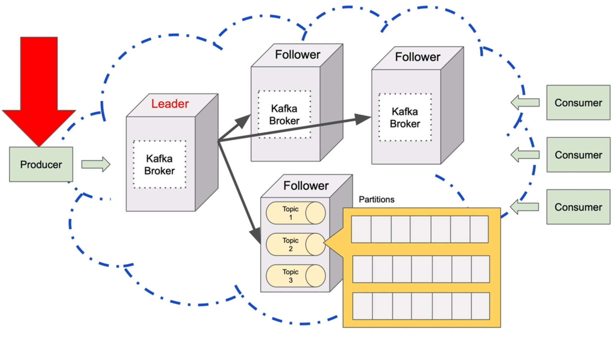
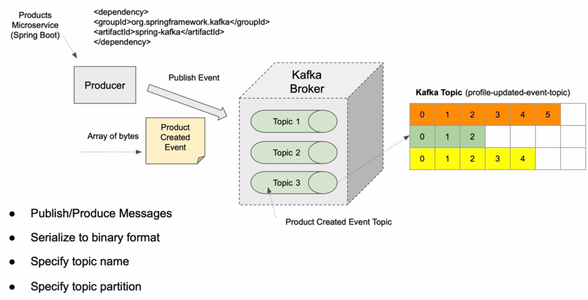
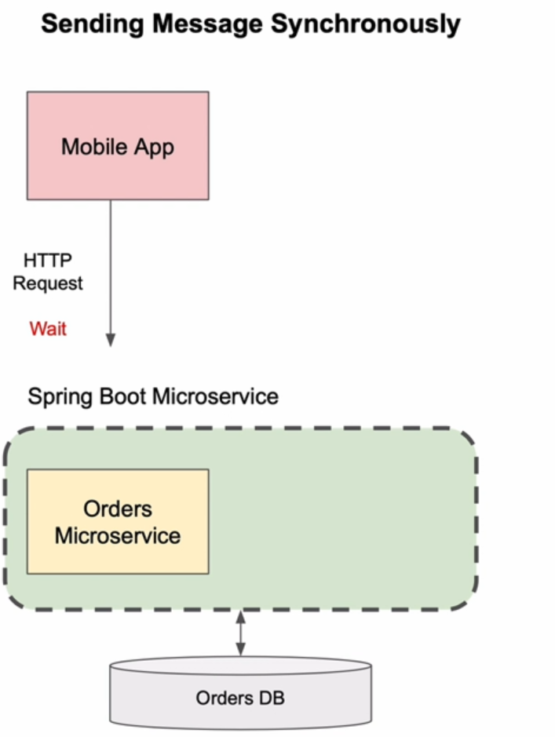
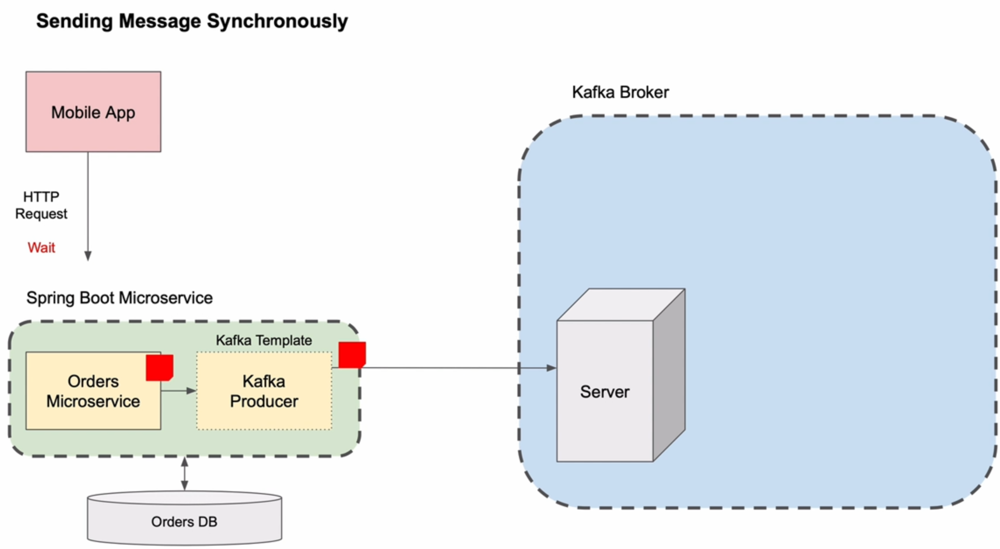
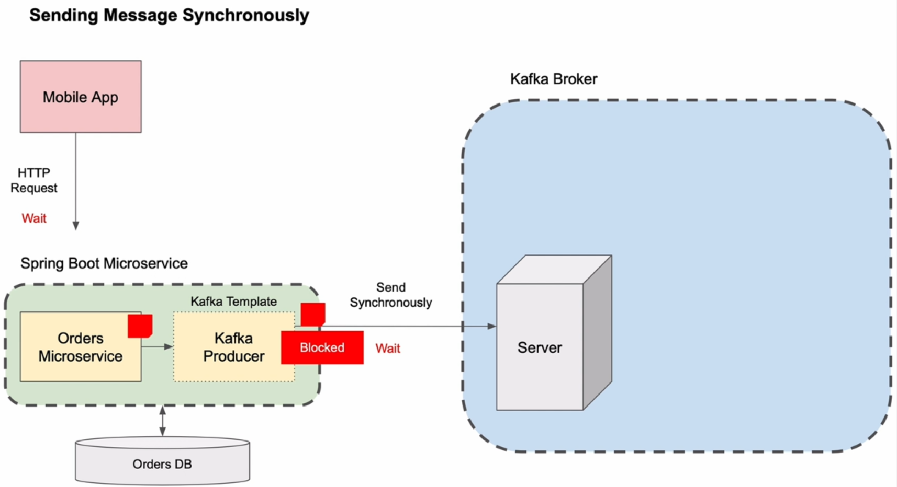
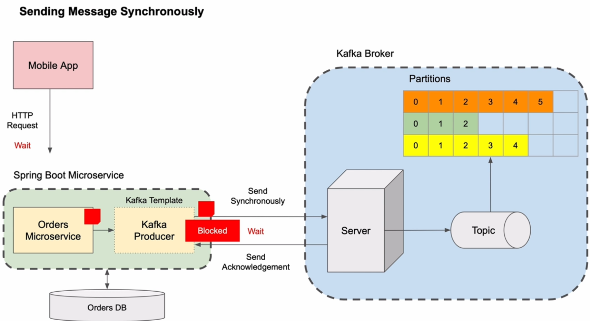
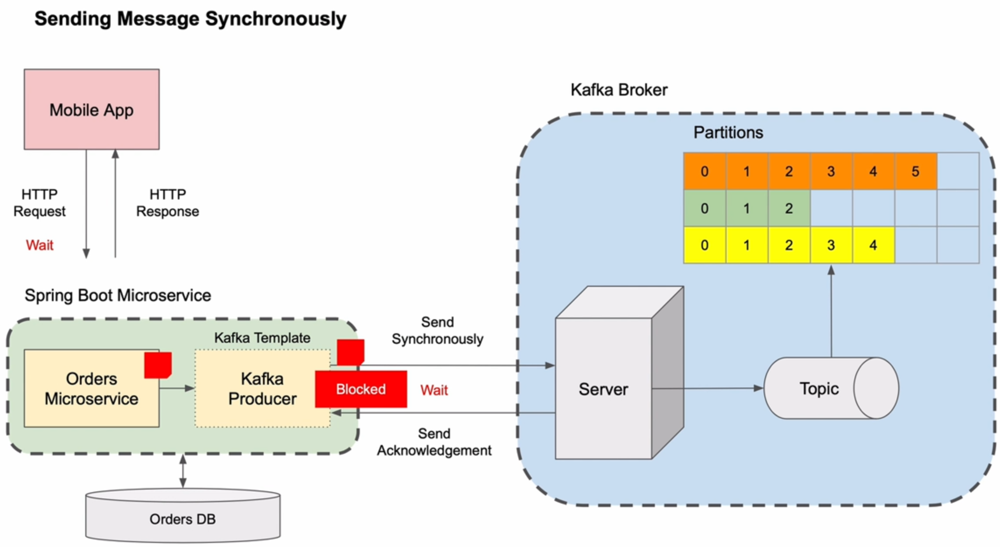
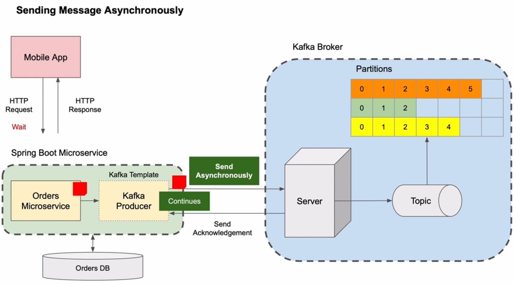

# 6. Kafka Producer - Spring Boot Microservice

## 2. Introduction to Kafka Producer

## 3. Kafka Producer - Introduction to synchronous communication style

## 4. Kafka Producer - A use case for asynchronous communication style

## 6. Creating a new Spring Boot project

## 7. Kafka Producer configuration properties

## 8. Creating Kafka Topic

## 9. Run Microservice to create a new topic

## 10. Creating Rest Controller

## 11. Creating a Service class

## 12. Creating an Event class

## 13. Kafka Producer Send Message Asynchronously

## 14. Kafka Asynchronous Send. Trying how it works

## 15. Kafka Producer Send Message Synchronously

## 16. Kafka Producer Handle Exception in Rest Controller

## 17. Kafka Producer Logging Record Metadata Information

## 18. Kafka Synchronous Send. Trying how it works
