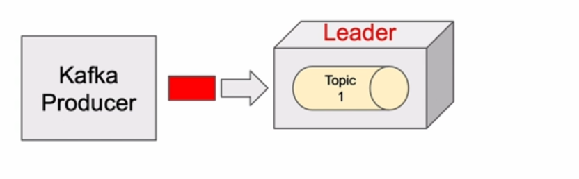

# 7. Kafka Producer Acknowledgements & Retries

## 2. Kafka Producer Acknowledgement

## 3. Kafka Producer Retries

## 4. Configure Producer Acknowledgments in Spring Boot Microservice

## 5. The min.insync.replicas configuration

## 6. Trying how the min.insync.replicas works

## 7. Producer Retries

## 8. Trying how Producer Retries work

## 9. Delivery & Request Timeout

## 10. Trying how Delivery & Request Timeout works
