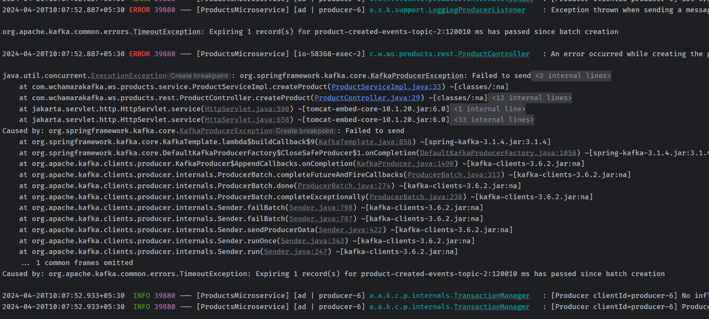

# 7. Kafka Producer Acknowledgements & Retries

## 2. Kafka Producer Acknowledgement


## 3. Kafka Producer Retries


## 4. Configure Producer Acknowledgments in Spring Boot Microservice

```yaml
/**
 * Configuration for the Kafka producer.
 * 
 * This configuration sets the following properties:
 * - `bootstrap-servers`: The list of Kafka broker addresses to connect to.
 * - `key-serializer`: The serializer class for the message keys.
 * - `value-serializer`: The serializer class for the message values.
 * - `acks`: The number of acknowledgements the producer requires the leader to have received before considering a request complete.
 */
spring:
    kafka:
        producer:
            bootstrap-servers: localhost:9092,localhost:9094
            key-serializer: org.apache.kafka.common.serialization.StringSerializer
            value-serializer: org.springframework.kafka.support.serializer.JsonSerializer
            acks: all
```

we can use `kafka.producer.acks` property to configure the producer acknowledgments. The value of this property can be one of the following:

## 5. The min.insync.replicas configuration


to update


## 6. Trying how the min.insync.replicas works

let's shutdown two brokers and then try to produce a message to the topic.


this will cause the producer to wait for the acknowledgment from the leader and one follower before considering the message as successfully produced.


## 7. Producer Retries

```yaml
/**
 * Configuration for the Kafka producer in the ProductsMicroservice application.
 * 
 * The producer is responsible for sending messages to the Kafka broker.
 * 
 * Configuration properties:
 * - bootstrap-servers: The list of Kafka broker addresses.
 * - key-serializer: The serializer class for the message keys.
 * - value-serializer: The serializer class for the message values.
 * - acks: The number of acknowledgements the producer requires the leader to have received before considering a request complete.
 * - retries: The number of times the producer will retry sending a message before giving up.
 * - properties.retry.backoff.ms: The time to wait between retries in milliseconds.
 * 
 * Other configuration:
 * - spring.application.name: The name of the application.
 * - server.port: The port on which the application will run.
 */
spring:
    application:
        name: ProductsMicroservice
    kafka:
        producer:
            bootstrap-servers: localhost:9092,localhost:9094
            key-serializer: org.apache.kafka.common.serialization.StringSerializer
            value-serializer: org.springframework.kafka.support.serializer.JsonSerializer
            acks: all
            retries: 10
            properties:
                retry:
                    backoff.ms: 1000


server:
    port: 58368
```

## 8. Trying how Producer Retries work

stop 2 brokers and try to produce a message to the topic.


## 9. Delivery & Request Timeout

```yaml
/**
 * Configuration properties for the Kafka producer in the ProductsMicroservice application.
 * 
 * - `spring.application.name`: Specifies the name of the application.
 * - `spring.kafka.producer.bootstrap-servers`: Specifies the Kafka bootstrap servers.
 * - `spring.kafka.producer.key-serializer`: Specifies the key serializer class for the producer.
 * - `spring.kafka.producer.value-serializer`: Specifies the value serializer class for the producer.
 * - `spring.kafka.producer.properties.delivery.timeout.ms`: Specifies the maximum time to wait for message delivery acknowledgement.
 * - `spring.kafka.producer.properties.linger.ms`: Specifies the delay in milliseconds to wait for more messages before sending a batch.
 * - `spring.kafka.producer.properties.request.timeout.ms`: Specifies the maximum time to wait for a response from the Kafka broker.
 * - `server.port`: Specifies the port on which the server should listen. Set to 0 to use any available port.
 */
spring:
    application:
        name: ProductsMicroservice
    kafka:
        producer:
            bootstrap-servers: localhost:9092,localhost:9094
            key-serializer: org.apache.kafka.common.serialization.StringSerializer
            value-serializer: org.springframework.kafka.support.serializer.JsonSerializer
            properties:
                delivery.timeout.ms: 120000
                linger.ms: 0
                request.timeout.ms: 30000

server:
    port: 0

```

## 10. Trying how Delivery & Request Timeout works



