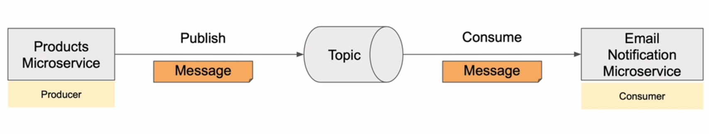
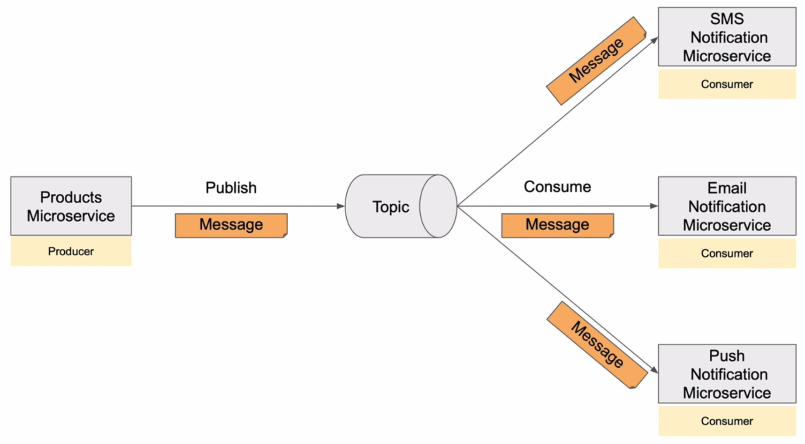
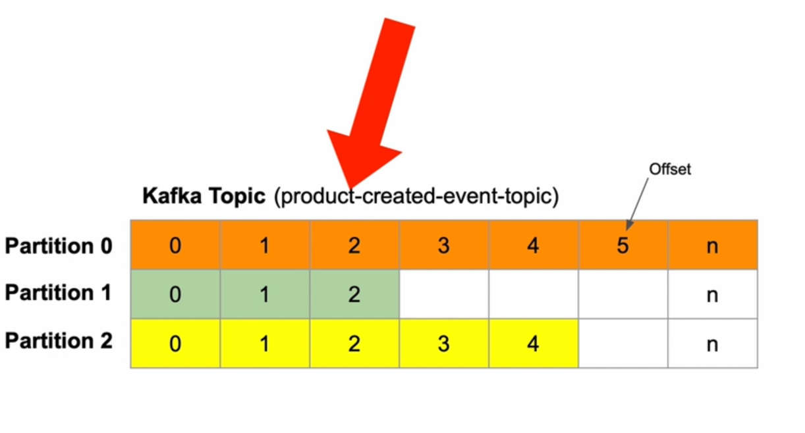
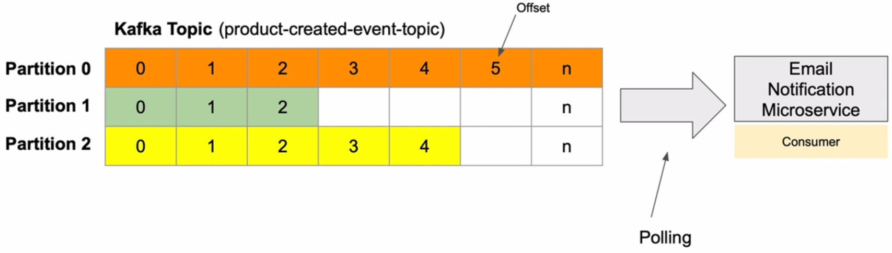
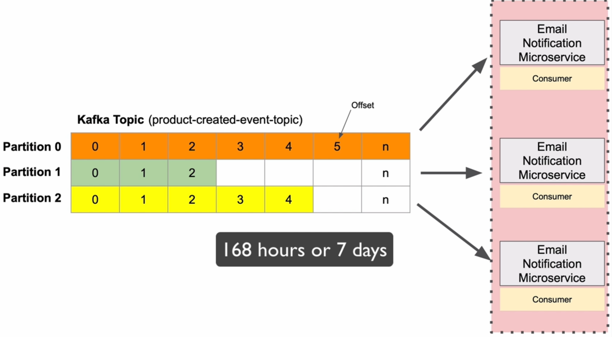

# 8. Kafka Consumer - Spring Boot Microservice

## 2. Introduction to Kafka Consumer







## 3. Creating a new Spring Boot project

let's create a new Spring Boot project using Spring Initializr. with dependencies:

- Spring Web
- Spring for Apache Kafka
- Spring Boot DevTools

## 4. Kafka Consumer Configuration Properties

```yaml
server:
  port:
spring:
  application:
    name: EmailNotificationMicroservice
  kafka:
    consumer:
      bootstrap-servers: localhost:9092,localhost:9094
      key-deserializer: org.apache.kafka.common.serialization.StringDeserializer
      value-deserializer: org.springframework.kafka.support.serializer.JsonDeserializer
      group-id: products-created-events
      properties:
        spring.json.trusted.packages: '*'

```

## 5. Kafka Consumer with @KafkaEventListener and @KafkaHandler annotations

## 6. Creating the core module

## 7. Adding core project as a dependency

## 8. @KafkaHandler Trying how it works

## 9. Kafka Consumer Spring Bean Configuration

## 10. Kafka Listener Container Factory

## 11. Trying if Kafka Consumer Bean Configuration works

products\rest\CreateProductResModel.java
