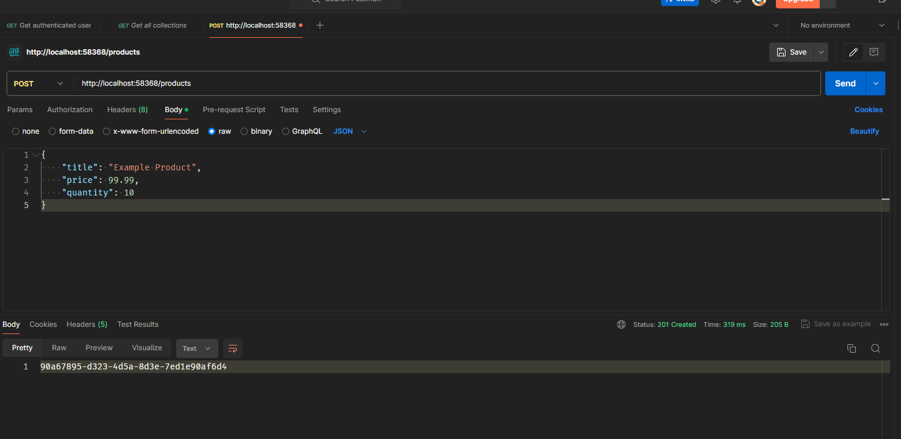

# 8. Kafka Consumer - Spring Boot Microservice

## 2. Introduction to Kafka Consumer


## 3. Creating a new Spring Boot project

let's create a new Spring Boot project using Spring Initializr. with dependencies:

- Spring Web
- Spring for Apache Kafka
- Spring Boot DevTools

## 4. Kafka Consumer Configuration Properties

```yaml
server:
  port:
spring:
  application:
    name: EmailNotificationMicroservice
  kafka:
    consumer:
      bootstrap-servers: localhost:9092,localhost:9094
      key-deserializer: org.apache.kafka.common.serialization.StringDeserializer
      value-deserializer: org.springframework.kafka.support.serializer.JsonDeserializer
      group-id: products-created-events
      properties:
        spring.json.trusted.packages: '*'

```

## 5. Kafka Consumer with @KafkaEventListener and @KafkaHandler annotations

```java
package com.wchamarakafka.ws.emailnotification.handler;

import org.slf4j.Logger;
import org.slf4j.LoggerFactory;
import org.springframework.kafka.annotation.KafkaHandler;
import org.springframework.kafka.annotation.KafkaListener;
import org.springframework.stereotype.Component;

@Component
@KafkaListener(topics = "product-created-events-topic")
public class ProductCreatedHandler {

    private final Logger logger = LoggerFactory.getLogger(ProductCreatedHandler.class);

    @KafkaHandler
    public void handle(ProdcutCreatedEvent prodcutCreatedEvent) {
        logger.info("Product created event received: {}", prodcutCreatedEvent.getTitle());
    }
}

```

## 6. Creating the core module

let's create a new module called `core` and add the following classes:
remove main class and the test file as well.


```xml
<?xml version="1.0" encoding="UTF-8"?>
<project xmlns="http://maven.apache.org/POM/4.0.0" xmlns:xsi="http://www.w3.org/2001/XMLSchema-instance"
         xsi:schemaLocation="http://maven.apache.org/POM/4.0.0 https://maven.apache.org/xsd/maven-4.0.0.xsd">
    <modelVersion>4.0.0</modelVersion>
    <parent>
        <groupId>org.springframework.boot</groupId>
        <artifactId>spring-boot-starter-parent</artifactId>
        <version>3.2.5</version>
        <relativePath/> <!-- lookup parent from repository -->
    </parent>
    <groupId>com.wchamarakafka.ws</groupId>
    <artifactId>core</artifactId>
    <version>0.0.1-SNAPSHOT</version>
    <name>core</name>
    <description>core</description>
    <properties>
        <java.version>21</java.version>
    </properties>
    <dependencies>

    </dependencies>


</project>
```

```java
package com.wchamarakafka.ws.products.service;

import java.math.BigDecimal;

public class ProductCreatedEvent {
    private String productId;
    private String title;
    private BigDecimal price;
    private Integer quantity;

    public ProductCreatedEvent() {
    }

    public ProductCreatedEvent(String productId, String title, BigDecimal price, Integer quantity) {
        this.productId = productId;
        this.title = title;
        this.price = price;
        this.quantity = quantity;
    }

    public String getProductId() {
        return productId;
    }

    public void setProductId(String productId) {
        this.productId = productId;
    }

    public String getTitle() {
        return title;
    }

    public void setTitle(String title) {
        this.title = title;
    }

    public BigDecimal getPrice() {
        return price;
    }

    public void setPrice(BigDecimal price) {
        this.price = price;
    }

    public Integer getQuantity() {
        return quantity;
    }

    public void setQuantity(Integer quantity) {
        this.quantity = quantity;
    }
}

```

## 7. Adding core project as a dependency

install the core project and add the dependency to the email notification microservice.

## 8. @KafkaHandler Trying how it works


## 9. Kafka Consumer Spring Bean Configuration

```java
package com.wchamarakafka.ws.emailnotification;

import org.apache.kafka.clients.consumer.ConsumerConfig;
import org.apache.kafka.common.serialization.StringDeserializer;
import org.springframework.context.annotation.Bean;
import org.springframework.context.annotation.Configuration;
import org.springframework.core.env.Environment;
import org.springframework.kafka.core.ConsumerFactory;
import org.springframework.kafka.core.DefaultKafkaConsumerFactory;
import org.springframework.kafka.support.serializer.JsonDeserializer;

import java.util.HashMap;
import java.util.Map;

@Configuration
public class KafkaConsumerConfiguration {

    Environment environment;

    public KafkaConsumerConfiguration(Environment environment) {
        this.environment = environment;
    }

    @Bean
    public ConsumerFactory<String, Object> consumerFactory() {
        Map<String, Object> config = new HashMap<>();
        config.put(ConsumerConfig.BOOTSTRAP_SERVERS_CONFIG, environment.getProperty("spring.kafka.bootstrap-servers"));
        config.put(ConsumerConfig.GROUP_ID_CONFIG, environment.getProperty("spring.kafka.consumer.group-id"));
        config.put(ConsumerConfig.KEY_DESERIALIZER_CLASS_CONFIG, StringDeserializer.class);
        config.put(ConsumerConfig.VALUE_DESERIALIZER_CLASS_CONFIG, JsonDeserializer.class);
        config.put(JsonDeserializer.TRUSTED_PACKAGES, environment.getProperty("spring.kafka.consumer.properties.spring.json.trusted.packages"));
        return new DefaultKafkaConsumerFactory<>(config);
    }

}
```

## 10. Kafka Listener Container Factory

## 11. Trying if Kafka Consumer Bean Configuration works

products\rest\CreateProductResModel.java
