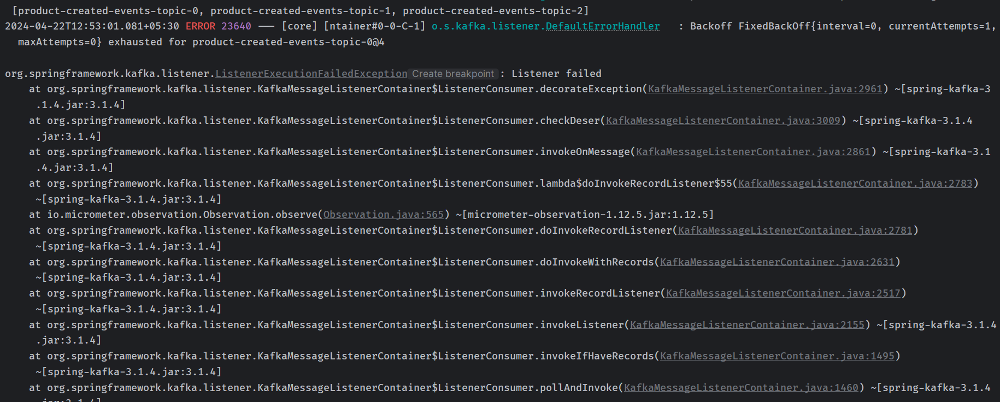

# 9. Kafka Consumer - Handle Deserializer Errors

## 2. Introduction to Error Handling in Kafka Consumer


## 3. Causing the deserialization problem

```powershell
.\kafka-console-producer.bat --bootstrap-server localhost:9092 --topic product-created-events-topic --property "parse.key=true" --property "key.separator=:"
>1:{asasdasd}
```


## 4. Kafka Consumer ErrorHandlingDeserializer

```java
package com.wchamarakafka.ws.emailnotification;

import org.apache.kafka.clients.consumer.ConsumerConfig;
import org.apache.kafka.common.serialization.StringDeserializer;
import org.springframework.context.annotation.Bean;
import org.springframework.context.annotation.Configuration;
import org.springframework.core.env.Environment;
import org.springframework.kafka.config.ConcurrentKafkaListenerContainerFactory;
import org.springframework.kafka.core.ConsumerFactory;
import org.springframework.kafka.core.DefaultKafkaConsumerFactory;
import org.springframework.kafka.support.serializer.ErrorHandlingDeserializer;
import org.springframework.kafka.support.serializer.JsonDeserializer;

import java.util.HashMap;
import java.util.Map;

@Configuration
public class KafkaConsumerConfiguration {

    Environment environment;

    public KafkaConsumerConfiguration(Environment environment) {
        this.environment = environment;
    }

    @Bean
    public ConsumerFactory<String, Object> consumerFactory() {
        Map<String, Object> config = new HashMap<>();
        config.put(ConsumerConfig.BOOTSTRAP_SERVERS_CONFIG, environment.getProperty("spring.kafka.consumer.bootstrap-servers"));
        config.put(ConsumerConfig.GROUP_ID_CONFIG, environment.getProperty("spring.kafka.consumer.group-id"));
        config.put(ConsumerConfig.KEY_DESERIALIZER_CLASS_CONFIG, StringDeserializer.class);
        config.put(ConsumerConfig.VALUE_DESERIALIZER_CLASS_CONFIG, ErrorHandlingDeserializer.class);
        config.put(ErrorHandlingDeserializer.VALUE_DESERIALIZER_CLASS, JsonDeserializer.class);
        config.put(JsonDeserializer.TRUSTED_PACKAGES, environment.getProperty("spring.kafka.consumer.properties.spring.json.trusted.packages"));
        return new DefaultKafkaConsumerFactory<>(config);
    }

    @Bean
    ConcurrentKafkaListenerContainerFactory<String, Object> kafkaListenerContainerFactory() {
        ConcurrentKafkaListenerContainerFactory<String, Object> factory = new ConcurrentKafkaListenerContainerFactory<>();
        factory.setConsumerFactory(consumerFactory());
        return factory;
    }

}
```

## 5. Trying how ErrorHandlingDeserializer works



now our application is able to handle the deserialization error and continue to consume the next message.
